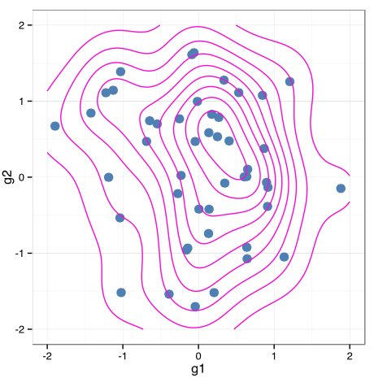

# gg4clj

R ggplot wrapper for Clojure, ported to PinkGorilla Notebook.

Essentially starts R in new process, issues R commands to it.
R library ggplot is used to render the plots as svg to a temporary file.
Temporary SVG file is rendered as hiccup marcup via Pinkie Rendering System (^:R)

An example, generating some random numbers in Clojure, and then plotting a 2D-density in ggplot:

```clojure
(defn b-m
  []
  (let [a (rand)
        b (rand)
        r (Math/sqrt (* -2 (Math/log a)))
        th (* 2 Math/PI b)]
    (* r (Math/cos th))))

(def g-dat {:g1 (repeatedly 50 b-m) :g2 (repeatedly 50 b-m)})

(gg4clj/view [[:<- :g (gg4clj/data-frame g-dat)]
              (gg4clj/r+
                [:ggplot :g [:aes :g1 :g2]]
                [:xlim -2 2]
                [:ylim -2 2]
                [:geom_point {:colour "steelblue" :size 4}]
                [:stat_density2d {:colour "#FF29D2"}]
                [:theme_bw])]
             {:width 5 :height 5})
```




## Setup


```

You will need to have R installed, and on your path so it's accessible from the command line. If you can run `Rscript`
from the command line, then you should be good to go. You will also need to make sure that the ggplot2 library is
installed in R, which you can do by running the following in R (you only need to do this once):

```R
install.packages("ggplot2")
```

## Usage

Central to gg4clj is a straightforward mapping of R code to Clojure data. There are only a few rules:

- R symbols are represented by Clojure keywords.
- R strings are represented by Clojure strings.
- All other Clojure types, for instance numbers, will be `pr-str`ed and fed to R.
- R function calls are represented by Clojure vectors, with the function name as the first element, and the (positional)
  arguments as subsequent elements.
- The last argument to a function call can be a map, which is used to represent named arguments.

So, for instance `[:qplot :mpg :hp {:data :mtcars :color [:factor :cyl]}]` translates to
`qplot(mpg, hp, data = mtcars, color = factor(cyl))`. The function `to-r` can be used to show what R code is generated
for a given data structure, and is useful for debugging.

A few additional helper functions are provided for manipulating R code. The function `data-frame` takes a Clojure map,
whose values are (equal length) seqs of data, and constructs an R data.frame with map keys as column names,
and map values as corresponding column data. Row names can be passed as a `:row.names` entry in this map. Note that this
function generates Clojure data corresponding to the R code that would generate the data.frame. This might seem
confusing, but it makes sense when considering using it for plotting (see examples).

ggplot2 makes extensive use of the `+` operator for adding layers etc. This is represented in Clojure data with a `:+`
function i.e. `[:+ thing1 thing2]`. However, R's `+` operator is at most binary, so this is inconvenient for adding more
than two things. To help with this gg4clj provides the `r+` function which will take any number of arguments, and
construct the R code which adds them together. For example, `(gg4clj/r+ :a :b :c)` evaluates to `[:+ [:+ :a :b] :c]`.

The function `render` does the work of sending code to R for evaluation. It takes a Clojure data structure, representing
some R code and:

- Prefixes it with code to load ggplot2.
- Postfixes it with code to save the last generated plot to a temporary file.
- Sends the code to R for evaluation, reads the generated plot, and cleans up.

It returns a string which is the plot rendered as SVG. It can take options (currently `:width` and `:height`) to control
the rendered output. Each evaluation is done in a new R process.

## History
- Original source is from JonyEpsilon: https://github.com/JonyEpsilon/gg4clj
- We forked from a more up-to-date fork from https://github.com/quan-nh/gg4clj

